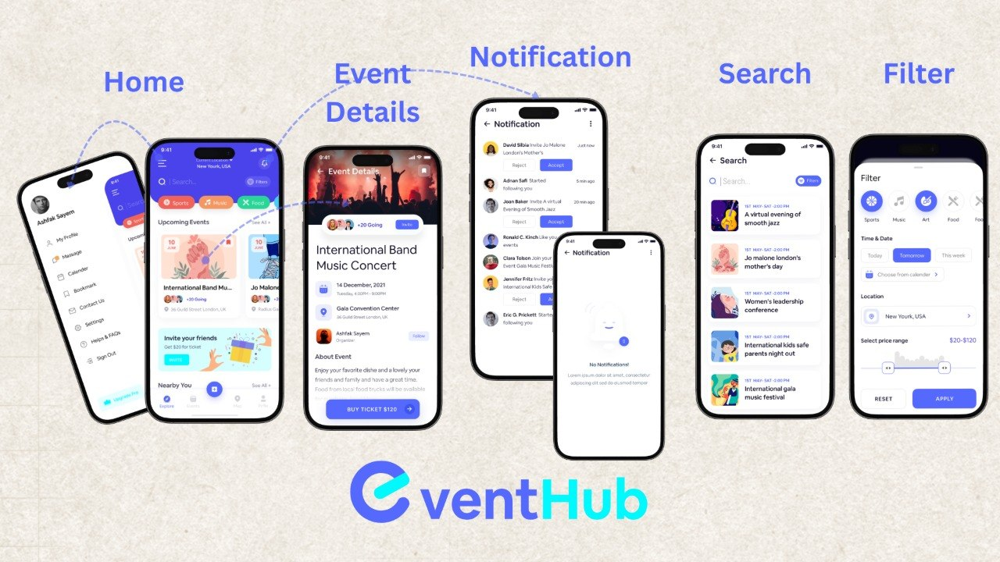
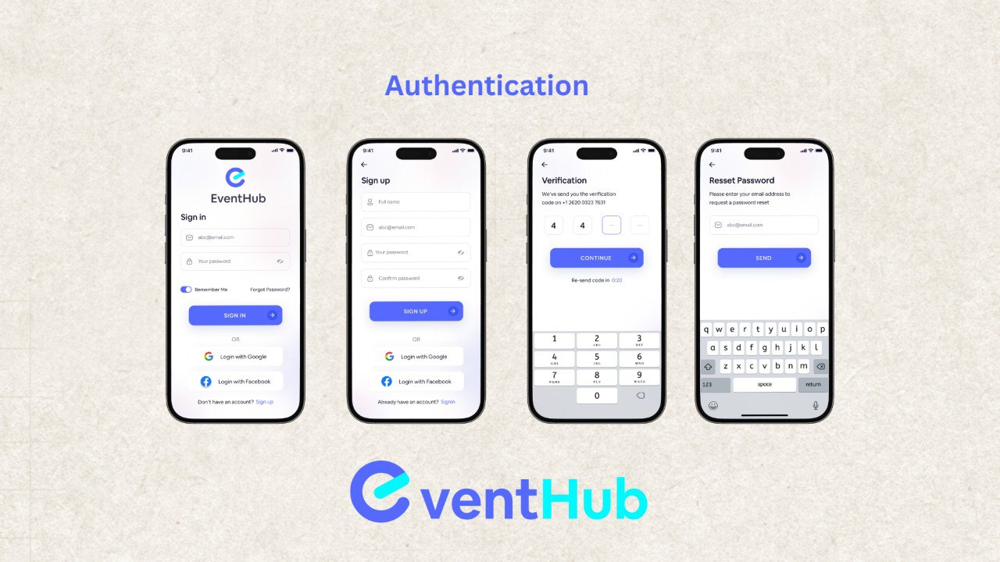
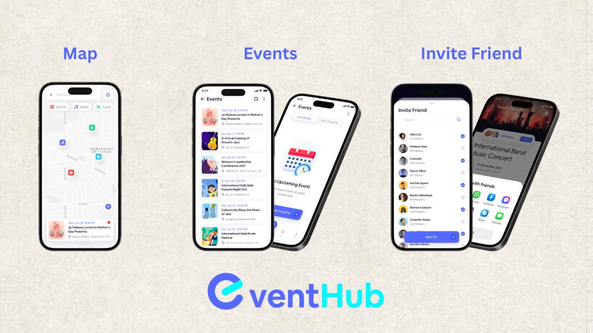
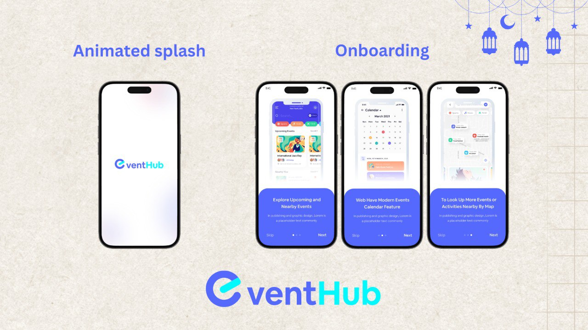
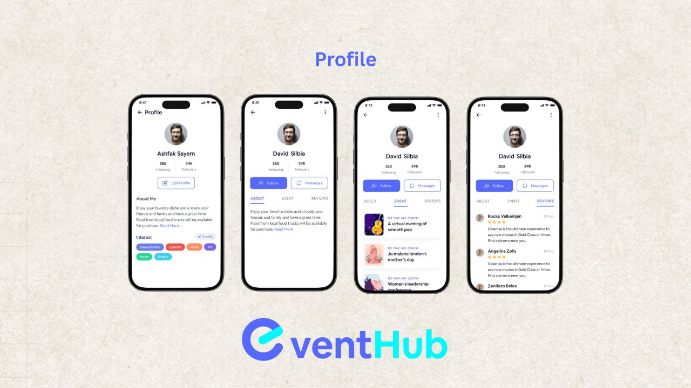

<div align="center">

<br/>


# Event Hub

### *Discover. Connect. Experience.*

**A beautifully crafted Flutter app for finding and managing events around you**

<br/>

[](https://flutter.dev)
[](https://dart.dev)
[](LICENSE)
[](https://flutter.dev)
[](CONTRIBUTING.md)
[](https://github.com/yourusername/event_hub_app/stargazers)

<br/>

[**Explore Features**](#-features) · [**Screenshots**](#-screenshots) · [**Quick Start**](#-getting-started)
<br/>

</div>

---

## 📱 Screenshots

<br/>

### 🏠 Core Screens

<div align="center">

<table>
  <tr>
    <td align="center" width="50%">
      <br/>
      <b>🏠 Home</b><br/>
      <sub>Browse upcoming events near you</sub>
    </td>
    <td align="center" width="50%">
      <br/>
      <b>🔑 Auth</b><br/>
      <sub>Find events by keyword or category</sub>
    </td>
  </tr>
  <tr>
    <td align="center" width="50%">
      <br/>
      <b>📋 Events</b><br/>
      <sub>Full event info, venue & ticket purchase</sub>
    </td>
    <td align="center" width="50%">
      <br/>
      <b>📭 intro</b><br/>
      <sub>Friendly illustrated empty state</sub>
    </td>
  </tr>
  <tr>
    <td align="center" colspan="2">
      <br/>
      <b>📃 profile</b><br/>
      <sub>Paginated full event listing</sub>
    </td>
  </tr>
</table>

</div>

<br/>

---

## ✨ Features

<br/>

> **Event Hub** is built around one core idea — making event discovery effortless and social.

<br/>

| 🗂️ Category | 🔥 Feature | 📝 Description |
|---|---|---|
| **Discovery** | 🏠 Home Feed | Personalized event recommendations based on location & interests |
| **Discovery** | 🔍 Smart Search | Real-time search by name, category, date, or organizer |
| **Discovery** | 🗺️ Map View | Interactive map to explore nearby events visually |
| **Events** | 📋 Event Details | Full info — date, venue, host bio, photos & description |
| **Events** | 🎟️ Ticket Purchase | In-app ticket buying with digital wallet support |
| **Events** | 📅 Calendar Sync | Add events directly to your device calendar |
| **Social** | 👤 User Profiles | Manage your profile, following list & saved events |
| **Social** | 🧑‍💼 Organizer Pages | Follow organizers and browse all their events |
| **Social** | 👥 Invite Friends | Share events and invite friends directly from the app |
| **System** | 🔔 Notifications | Event reminders, social activity & ticket alerts |
| **System** | 🌟 Onboarding | Smooth, illustrated intro for first-time users |
| **System** | 🌐 Multi-platform | Runs on Android, iOS & Web from a single codebase |

<br/>

---

## 🏗️ Architecture

Event Hub follows a **Feature-First Clean Architecture** — each feature is a self-contained vertical slice with its own data, domain, and presentation layers.

```
📦 event_hub_app/
┃
┣ 📂 lib/
┃   ┣ 📂 core/                    # Shared infrastructure
┃   ┃   ┣ 📂 helper/              #   → helper component
┃   ┃   ┣ 📂 functions/           #   → core funcyions
┃   ┃   ┣ 📂 widgets/             #   → core widgets
┃   ┃   ┗ 📂 utils/               #   → Extensions, helpers, constants, Colors, typography, spacing
┃   ┃
┃   ┣ 📂 features/                # Feature modules
┃   ┃   ┣ 📂 auth/                #   → Login, register, forgot password
┃   ┃   ┣ 📂 splash/              #   → animated splash
┃   ┃   ┣ 📂 onboarding/          #   → Splash, walkthrough screens
┃   ┃   ┣ 📂 nav_bar/             #   → core of app
┃   ┃   ┣ 📂 home/                #   → Feed, banners, categories
┃   ┃   ┣ 📂 events/              #   → List, map, tickets
┃   ┃   ┣ 📂 event_details/       #   → event detail, invite
┃   ┃   ┣ 📂 search/              #   → Search bar, filters, results
┃   ┃   ┣ 📂 profile/             #   → User & organizer profiles
┃   ┃   └ 📂 notifications/       #   → Notification center
┃   ┃   └ 📂 share_event/         #   → share_event
┃   ┃
┃   └ 📜 main.dart                # App entry point
┃
┣ 📂 assets/                      # Fonts, images, icons, animations
┣ 📂 screenshots/                 # App store & README screenshots
┣ 📂 test/                        # Unit, widget & integration tests
┣ 📜 pubspec.yaml
└ 📜 README.md
```

Each feature module follows this internal structure:

```
feature/
├── data/
│   ├── datasources/      # Remote & local data sources
│   ├── models/           # JSON serializable DTOs
│   └── repositories/     # Concrete repository implementations
└── presentation/
    ├── pages/            # Full screen routes
    ├── widgets/          # Reusable UI components
    └── bloc/ (or cubit/) # State management
```

<br/>

---

## 🚀 Getting Started

### Prerequisites

Make sure you have the following installed:

- **Flutter SDK** `>=3.0.0` — [Install Flutter](https://flutter.dev/docs/get-started/install)
- **Dart SDK** `>=3.0.0` *(bundled with Flutter)*
- **Android Studio** or **Xcode** for mobile targets
- **VS Code** *(recommended)* with the Flutter extension

Check your setup:
```bash
flutter doctor -v
```

<br/>

### ⚡ Quick Start

```bash
# 1. Clone the repository
git clone https://github.com/yourusername/event_hub_app.git
cd event_hub_app

# 2. Install dependencies
flutter pub get

# 3. Generate code (freezed, json_serializable, etc.)
dart run build_runner build --delete-conflicting-outputs

# 4. Run the app
flutter run                    # Default connected device
flutter run -d android         # Android emulator/device
flutter run -d ios             # iOS simulator/device
flutter run -d chrome          # Web (Chrome)
```

<br/>

### 📦 Build for Production

```bash
# Android — release APK
flutter build apk --release

# Android — App Bundle (recommended for Play Store)
flutter build appbundle --release

# iOS — release archive
flutter build ios --release

# Web — optimized build
flutter build web --release --web-renderer canvaskit
```

<br/>

---

## 🧪 Testing

```bash
# Run all tests
flutter test

# Run with coverage
flutter test --coverage

# View coverage report (requires lcov)
genhtml coverage/lcov.info -o coverage/html
open coverage/html/index.html

# Integration tests
flutter test integration_test/
```

Test structure follows the same feature-first layout:
```
test/
├── core/          # Utility & service tests
├── features/
│   ├── auth/
│   ├── events/
│   └── ...
└── helpers/       # Shared test fixtures & mocks
```

<br/>

---

## 📄 License

This project is licensed under the **MIT License** — see the [LICENSE](LICENSE) file for full details.

```
MIT License © 2024 Event Hub Contributors
```

<br/>

---

<div align="center">

### ⭐ If you find this project useful, please give it a star!

*It helps others discover the project and motivates further development.*

<br/>

**Built with ❤️ using [Flutter](https://flutter.dev)**

<br/>

</div>
